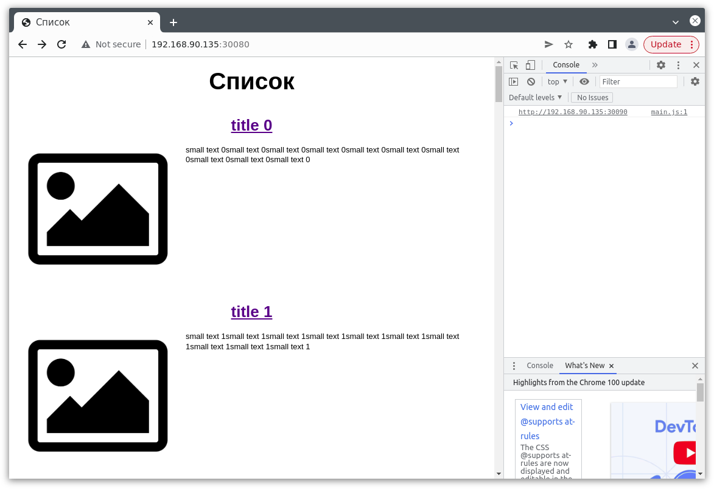

# Домашнее задание к занятию "13.1 контейнеры, поды, deployment, statefulset, services, endpoints"
Настроив кластер, подготовьте приложение к запуску в нём. Приложение стандартное: бекенд, фронтенд, база данных. Его можно найти в папке 13-kubernetes-config.

## Задание 1: подготовить тестовый конфиг для запуска приложения
Для начала следует подготовить запуск приложения в stage окружении с простыми настройками. Требования:
* под содержит в себе 2 контейнера — фронтенд, бекенд;
* регулируется с помощью deployment фронтенд и бекенд;
* база данных — через statefulset.

#### Ответ:
1. Соберем frontend контейнер и загрузим его в репозиторий
```
docker build -t lutovp/test-frontend:0.0.1 .
```
```
docker push lutovp/test-frontend:0.0.1 
```
```
devuser@devuser-virtual-machine:~/home_works/13-kubernetes-config-01-objects/13-kubernetes-config/frontend$ docker build -t lutovp/test-frontend:0.0.1 .
Sending build context to Docker daemon  430.6kB
Step 1/14 : FROM node:lts-buster as builder
 ---> b9f398d30e45
Step 2/14 : RUN mkdir /app
 ---> Using cache

```
```
devuser@devuser-virtual-machine:~/home_works/13-kubernetes-config-01-objects/13-kubernetes-config/frontend$ docker push lutovp/test-frontend:0.0.1 
The push refers to repository [docker.io/lutovp/test-frontend]
206bf5621531: Pushed 
069df5ac6784: Pushed 
ce194e6833cf: Pushed 
a7efede9ac60: Pushed 
e7344f8a29a3: Pushed 
44193d3f4ea2: Pushed 
41451f050aa8: Pushed 
b2f82de68e0d: Pushed 
d5b40e80384b: Pushed 
08249ce7456a: Pushed 
0.0.1: digest: sha256:b83697085a07a13a76a4dcbcb470359e01977a2358289c36954c655c638e1f30 size: 2401
```

2. Соберем backend контейнер и загрузим его в репозиторий

```
docker build -t lutovp/test-backend:0.0.1 .
```
```
docker push lutovp/test-backend:0.0.1 
```
```
devuser@devuser-virtual-machine:~/home_works/13-kubernetes-config-01-objects/13-kubernetes-config/backend$ docker build -t lutovp/test-backend:0.0.1 .
Sending build context to Docker daemon  19.46kB
Step 1/8 : FROM python:3.9-buster
 ---> 999912f2c071
Step 2/8 : RUN mkdir /app && python -m pip install pipenv
 ---> Using cache
 ---> d9b78c6d5427
Step 3/8 : WORKDIR /app
 ---> Using cache
```

```
devuser@devuser-virtual-machine:~/home_works/13-kubernetes-config-01-objects/13-kubernetes-config/backend$ docker push lutovp/test-backend:0.0.1 The push refers to repository [docker.io/lutovp/test-backend]
40760574ce65: Pushed 
297faeb707de: Pushed 
22fc1da79ed0: Pushed 
f536b816f39e: Pushed 
579e7afd94b3: Pushed 
843f990feb92: Mounted from library/python 
70dce5ebf427: Mounted from library/python 
aba5ac262080: Mounted from library/python 
2df8715307ad: Mounted from library/python 
e6fd4ebbaaab: Mounted from library/python 
261e5d6450d3: Mounted from library/python 
65d22717bade: Mounted from library/python 
3abde9518332: Mounted from library/python 
0c8724a82628: Mounted from library/python 
0.0.1: digest: sha256:60c31aab3f08b69e1085cc2cf0031818478f8b2ad8b45a0c5ede5fb0cd818601 size: 3264

```
3. Создадим Namespace stage
```
kubectl create ns stage
```

4. Создадим манифесты для postgres. 


```
#сonfigmap.yml 

apiVersion: v1
kind: ConfigMap
metadata:
  name: postgres-configuration
  namespace: stage  
  labels:
    app: postgres
data:
  POSTGRES_DB: news
  POSTGRES_USER: postgres
  POSTGRES_PASSWORD: postgres
```

```
#statefulset.yml
apiVersion: apps/v1
kind: StatefulSet
metadata:
  name: postgres-statefulset
  namespace: stage  
  labels:
    app: postgres
spec:
  serviceName: "postgres"
  replicas: 1
  selector:
    matchLabels:
      app: postgres
  template:
    metadata:
      labels:
        app: postgres
    spec:
      containers:
      - name: postgres
        image: postgres:13-alpine
        envFrom:
        - configMapRef:
            name: postgres-configuration
        ports:
        - containerPort: 5432
          name: postgresdb
```
```
#service.yml Сервис нужен чтобы можно было подключиться из других подов и извне кластрера 

apiVersion: v1
kind: Service
metadata:
  name: db
  namespace: stage  
  labels:
    app: postgres
spec:
  ports:
  - port: 5432
    name: postgres
    nodePort: 30432
  type: NodePort 
  selector:
    app: postgres
```

Складываем в папку database и применяем
```
kubectl apply -f database/ -n stage
```

В результате можно будет подключиться извне кластера к ноде где развернется statefulset по порту 30432 для проверки

Создадим deployment для приложения:

```
#frontandback.yml

apiVersion: apps/v1
kind: Deployment
metadata:
  labels:
    app: news
  name: news
  namespace: stage
spec:
  replicas: 1
  selector:
    matchLabels:
      app: news
  template:
    metadata:
      labels:
        app: news
    spec:
      containers:
        - image: lutovp/test-backend:0.0.1
          imagePullPolicy: IfNotPresent
          name: backend
          ports:
            - containerPort: 9000
        - image: lutovp/test-frontend:0.0.1
          imagePullPolicy: IfNotPresent
          name: frontend
          ports:
            - containerPort: 80       

```
Чтобы проверить работоспособность приложения создадим сервис типа NodePort для frontend
```

apiVersion: v1
kind: Service
metadata:
  name: frontend
  namespace: stage
spec:
  ports:
    - name: web
      port: 8000
      targetPort: 80
      nodePort: 30080     
  selector:
    app: news
  type: NodePort

```
Бэкенд работает на 9000 порту чтобы фронт на клиенте мог достучаться до бека нужен тоже сервис
```
apiVersion: v1
kind: Service
metadata:
  name: backend
  namespace: stage
spec:
  ports:
    - name: web
      port: 9000
      targetPort: 9000  
  selector:
    app: news
  type: ClusterIP
```
Кроме того нужно сделать port forwarding так как фронт обращается к беку на локалхост на 9000 порт

Применим манифесты:
```
kubectl apply -f frontback/ -n stage
``` 


В результате получаем:
```
devuser@devuser-virtual-machine:~/home_works/13-kubernetes-config-01-objects/stage$ kubectl get pods -n stage
NAME                     READY   STATUS    RESTARTS     AGE
news-85d798c67-79hlg     2/2     Running   0            8h
postgres-statefulset-0   1/1     Running   1 (8h ago)   24h
```

```
devuser@devuser-virtual-machine:~/home_works/13-kubernetes-config-01-objects/stage$ kubectl get services -n stage
NAME       TYPE        CLUSTER-IP      EXTERNAL-IP   PORT(S)           AGE
db         NodePort    10.233.46.236   <none>        5432:30432/TCP    23h
frontend   NodePort    10.233.55.240   <none>        8000:30080/TCP    8h
news       ClusterIP   10.233.44.31    <none>        9000/TCP,80/TCP   23h
```

```
devuser@devuser-virtual-machine:~/home_works/13-kubernetes-config-01-objects/stage$ kubectl get deployments -n stage
NAME   READY   UP-TO-DATE   AVAILABLE   AGE
news   1/1     1            1           23h
```

пробуем подключиться


Сделаем port-forward для деплоймента чтобы фронт увидел бэк по localhost:9000

```
kubectl port-forward deployments/news 9000:9000 -n stage

devuser@devuser-virtual-machine:~/home_works/13-kubernetes-config-01-objects/stage$ kubectl port-forward deployments/news 9000:9000 -n stage
Forwarding from 127.0.0.1:9000 -> 9000
Forwarding from [::1]:9000 -> 9000
Handling connection for 9000
```


# Задание 2: подготовить конфиг для production окружения
Следующим шагом будет запуск приложения в production окружении. Требования сложнее:
* каждый компонент (база, бекенд, фронтенд) запускаются в своем поде, регулируются отдельными deployment’ами;
* для связи используются service (у каждого компонента свой);
* в окружении фронта прописан адрес сервиса бекенда;
* в окружении бекенда прописан адрес сервиса базы данных.

1. Создадим Namespace prod
```
kubectl create ns prod
```

Манифесты для базы: `manifests/prod/database/` 

Манифесты для бекенда: `manifests/prod/backend/` 

Манифесты для фронтенда: `manifests/prod/frontend/`

Применяем:

```
kubectl apply -f database/ 

kubectl apply -f backend/ 

kubectl apply -f frontend/ 
```


Пробрасываем наружу бекенд

```
kubectl port-forward deployments/backend 9000:9000 -n prod
```

## Задание 3 (*): добавить endpoint на внешний ресурс api
Приложению потребовалось внешнее api, и для его использования лучше добавить endpoint в кластер, направленный на это api. Требования:
* добавлен endpoint до внешнего api (например, геокодер).

---

### Как оформить ДЗ?

Выполненное домашнее задание пришлите ссылкой на .md-файл в вашем репозитории.

В качестве решения прикрепите к ДЗ конфиг файлы для деплоя. Прикрепите скриншоты вывода команды kubectl со списком запущенных объектов каждого типа (pods, deployments, statefulset, service) или скриншот из самого Kubernetes, что сервисы подняты и работают.

---
